## Nama           : M Ilham Firdaus

## Kelas          : TI.23.C1

## NIM            : 312310021

## Mata Kuliah    : Pemrograman Web 2

## Dosen Pengampu : Agung Nugroho, S.Kom., M.Kom

## Universitas    : Universitas Pelita Bangsa

## Hasil Praktikum 1: PHP Framework (Codeigniter)

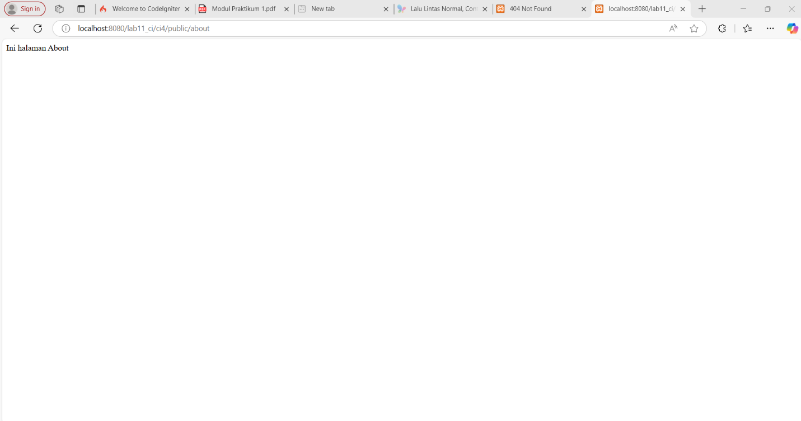

## Praktikum 2: Framework Lanjutan (CRUD)

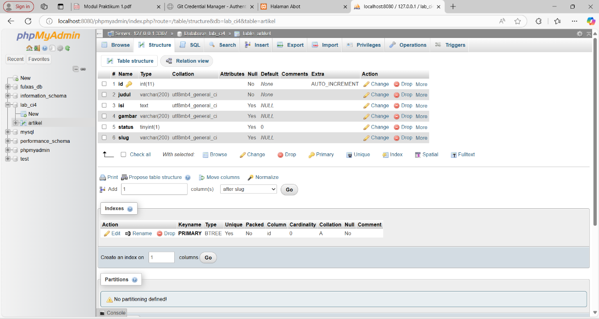

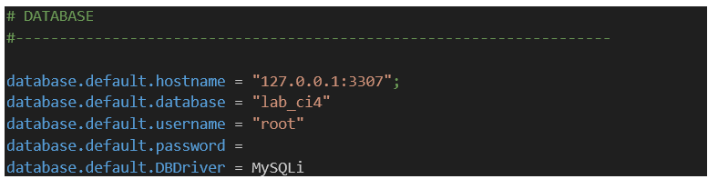

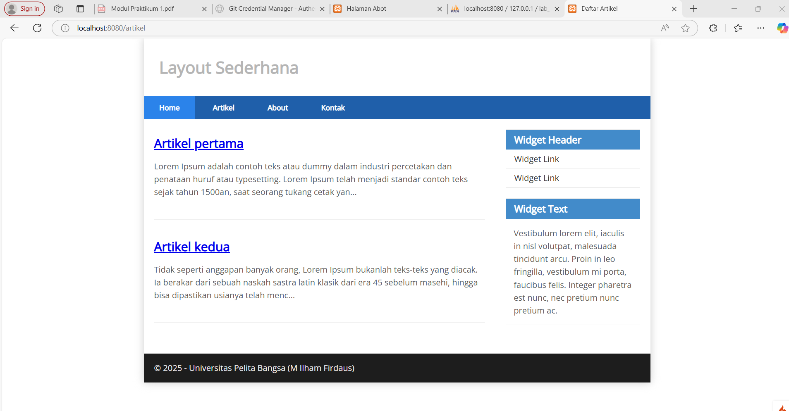

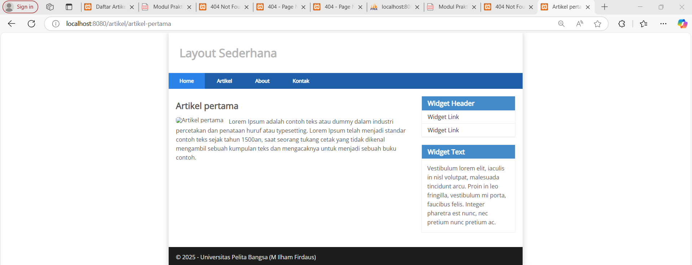

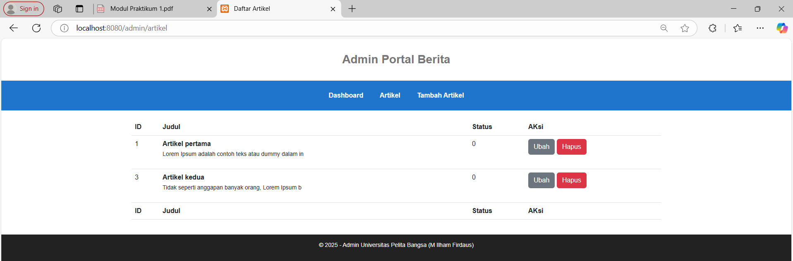

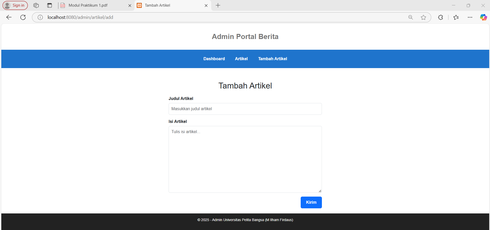

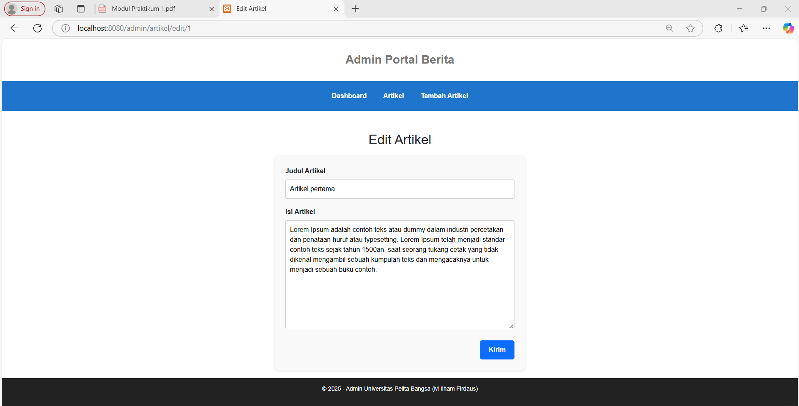

## Praktikum 3: View Layout dan View Cell

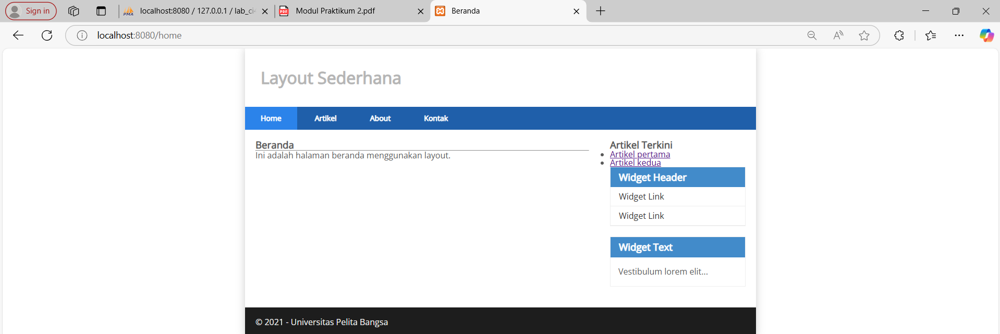

Penjelasan

1. Manfaat View Layout: memudahkan pembuatan tampilan konsisten dan DRY (Don't Repeat Yourself).

2. Perbedaan View Cell vs View biasa:

  - View Biasa: hanya digunakan langsung di controller.

  - View Cell: bisa digunakan berulang kali seperti komponen/modul.

3. Modifikasi View Cell untuk hanya menampilkan post dengan kategori tertentu.

## Praktikum 4: Login System (Modul Login - CodeIgniter 4)

### 🔧 Langkah-Langkah:

#### 1. Membuat Tabel `user` di Database
Saya membuat tabel `user` dengan struktur: `id`, `username`, `useremail`, `userpassword`.

**Screenshot:**
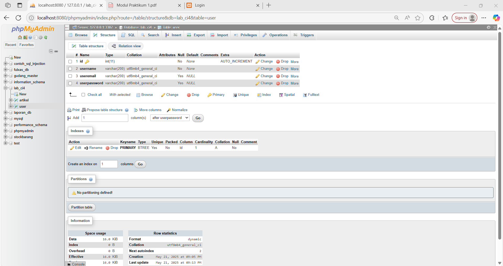

#### 2. Membuat Model `UserModel.php`
Model dibuat untuk menangani data login di `app/Models/UserModel.php`.

#### 3. Membuat Controller `User.php`
Berisi method `login()`, `logout()`, dan `index()` untuk login system.

**Screenshot:**
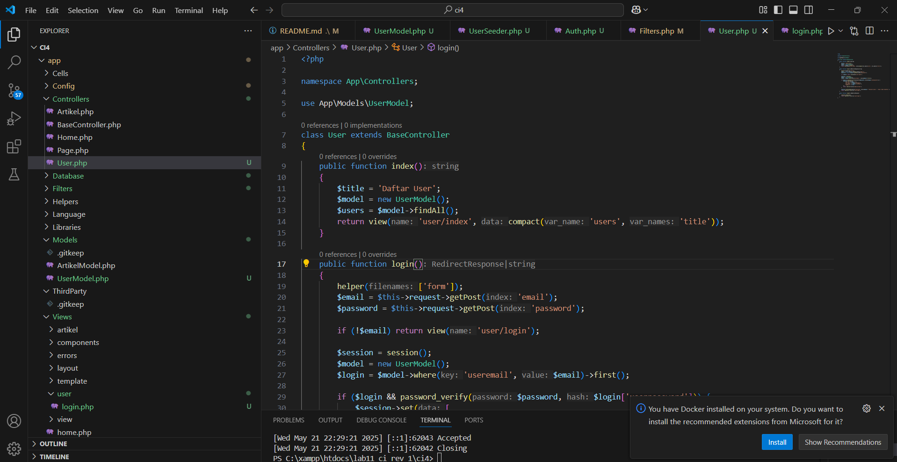

#### 4. Membuat View `login.php`
Form login dibuat lebih menarik menggunakan Bootstrap.

**Screenshot:**
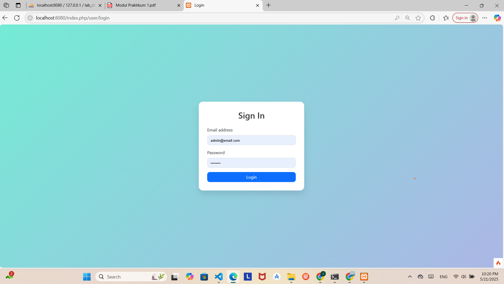

#### 5. Membuat Seeder `UserSeeder.php`
Seeder dibuat untuk mengisi data user admin menggunakan:
`bash
php spark db:seed UserSeeder 

#### 6. Membuat Filter Auth.php

Digunakan untuk melindungi halaman admin dari akses tanpa login.

#### 7. Konfigurasi Routing
Menambahkan route untuk login, logout, dan halaman admin yang dilindungi oleh filter auth.

Screenshot:

#### 8. Uji Login, Logout, dan Proteksi Admin
Login berhasil akan diarahkan ke halaman admin.

Logout akan menghapus session dan kembali ke login.

Akses langsung ke /admin/artikel akan diarahkan ke /user/login jika belum login.

## Praktikum 5: Pagination dan Pencarian

### 1. Pagination
Saya mengedit controller Artikel untuk menampilkan daftar artikel menggunakan paginate(3) dan menampilkan pagination links di view.

**Screenshot:**
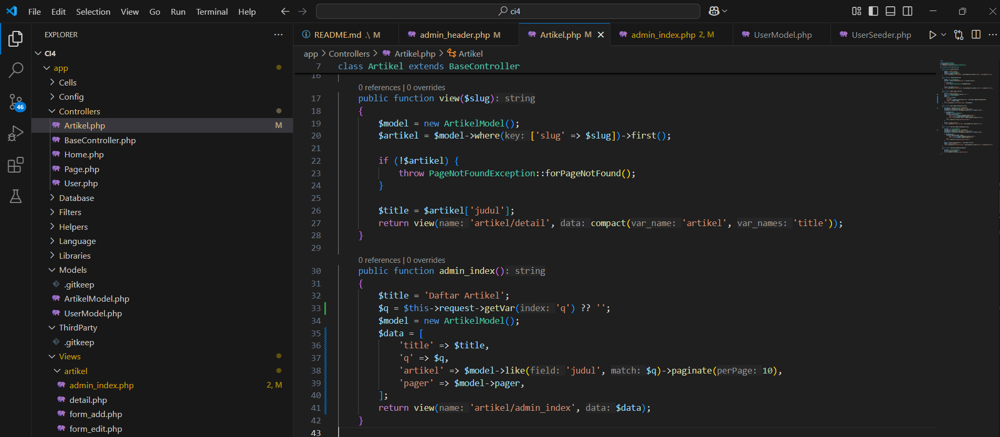

### 2. Pencarian
Saya menambahkan fitur pencarian dengan query `q`, melakukan filter `like('judul', $q)` dan menyesuaikan tampilan form di view.

**Screenshot:**
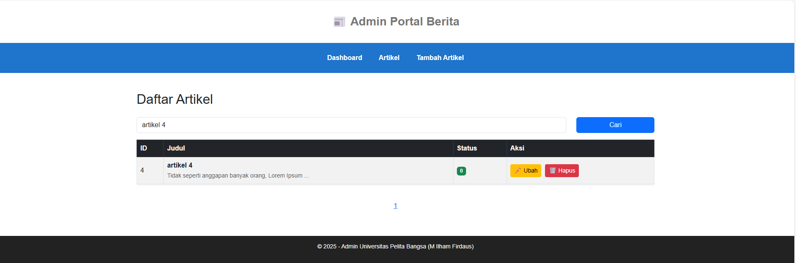

### 3. Uji Coba
- Pagination muncul saat data lebih dari 3.
- Pencarian berhasil menampilkan data yang relevan.

**Screenshot:**
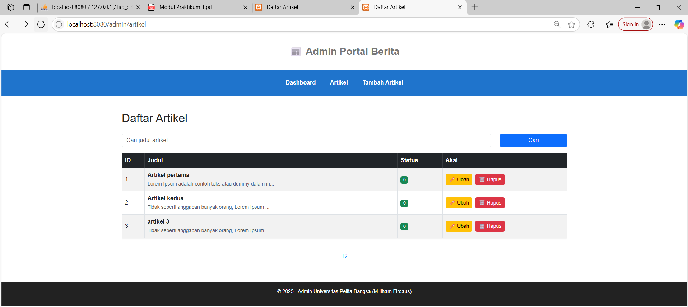

## Praktikum 6: Upload File Gambar
- Menambahkan input file `gambar` di form `artikel/form_add.php`
- Menyesuaikan tag `<form>` dengan `enctype="multipart/form-data"`
- Mengupdate method `add()` pada `Artikel.php` untuk menyimpan file gambar ke folder `public/gambar`
- Menyimpan nama file gambar ke database

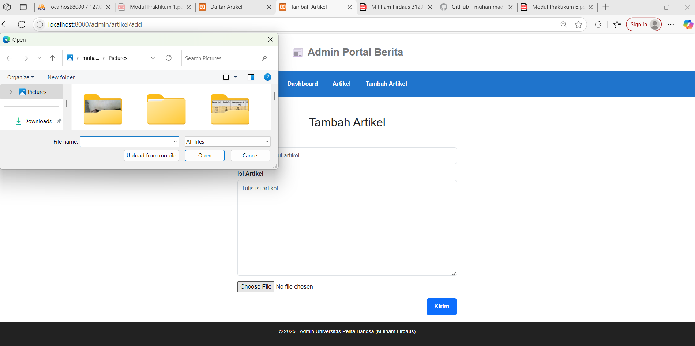

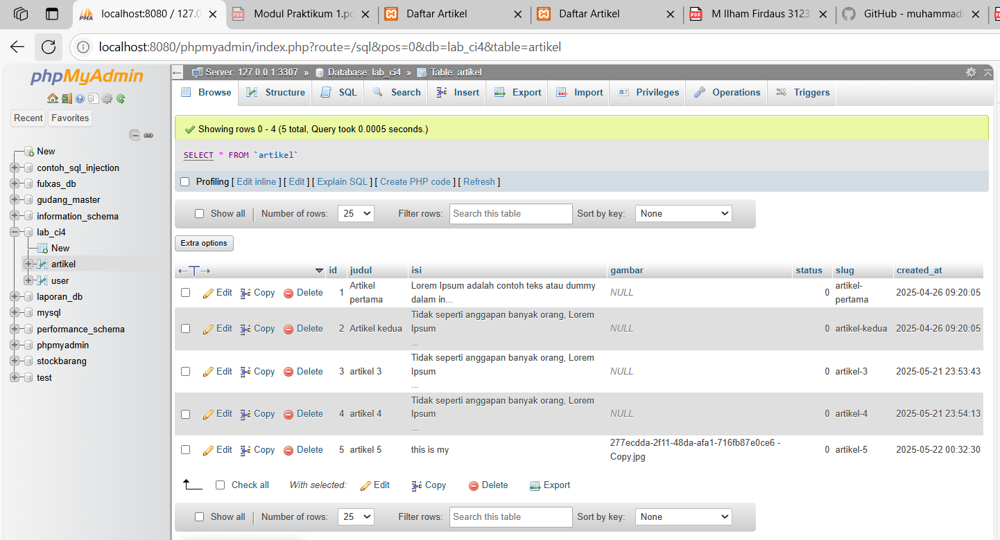

