## Nama           : M Ilham Firdaus

## Kelas          : TI.23.C1

## NIM            : 312310021

## Mata Kuliah    : Pemrograman Web 2

## Dosen Pengampu : Agung Nugroho, S.Kom., M.Kom

## Universitas    : Universitas Pelita Bangsa

## Hasil Praktikum 1: PHP Framework (Codeigniter)

## Praktikum 2: Framework Lanjutan (CRUD)

## Praktikum 3: View Layout dan View Cell

Penjelasan

1. Manfaat View Layout: memudahkan pembuatan tampilan konsisten dan DRY (Don't Repeat Yourself).

2. Perbedaan View Cell vs View biasa:

  - View Biasa: hanya digunakan langsung di controller.

  - View Cell: bisa digunakan berulang kali seperti komponen/modul.

3. Modifikasi View Cell untuk hanya menampilkan post dengan kategori tertentu.

## Praktikum 4: Login System (Modul Login - CodeIgniter 4)

### 🔧 Langkah-Langkah:

#### 1. Membuat Tabel `user` di Database
Saya membuat tabel `user` dengan struktur: `id`, `username`, `useremail`, `userpassword`.

**Screenshot:**

#### 2. Membuat Model `UserModel.php`
Model dibuat untuk menangani data login di `app/Models/UserModel.php`.

#### 3. Membuat Controller `User.php`
Berisi method `login()`, `logout()`, dan `index()` untuk login system.

**Screenshot:**

#### 4. Membuat View `login.php`
Form login dibuat lebih menarik menggunakan Bootstrap.

**Screenshot:**

#### 5. Membuat Seeder `UserSeeder.php`
Seeder dibuat untuk mengisi data user admin menggunakan:
`bash
php spark db:seed UserSeeder 

#### 6. Membuat Filter Auth.php

Digunakan untuk melindungi halaman admin dari akses tanpa login.

#### 7. Konfigurasi Routing
Menambahkan route untuk login, logout, dan halaman admin yang dilindungi oleh filter auth.

Screenshot:

#### 8. Uji Login, Logout, dan Proteksi Admin
Login berhasil akan diarahkan ke halaman admin.

Logout akan menghapus session dan kembali ke login.

Akses langsung ke /admin/artikel akan diarahkan ke /user/login jika belum login.

## Praktikum 5: Pagination dan Pencarian

### 1. Pagination
Saya mengedit controller Artikel untuk menampilkan daftar artikel menggunakan paginate(3) dan menampilkan pagination links di view.

**Screenshot:**

### 2. Pencarian
Saya menambahkan fitur pencarian dengan query `q`, melakukan filter `like('judul', $q)` dan menyesuaikan tampilan form di view.

**Screenshot:**

### 3. Uji Coba
- Pagination muncul saat data lebih dari 3.
- Pencarian berhasil menampilkan data yang relevan.

**Screenshot:**

## Praktikum 6: Upload File Gambar
- Menambahkan input file `gambar` di form `artikel/form_add.php`
- Menyesuaikan tag `<form>` dengan `enctype="multipart/form-data"`
- Mengupdate method `add()` pada `Artikel.php` untuk menyimpan file gambar ke folder `public/gambar`
- Menyimpan nama file gambar ke database

tambah artikel

gambar masuk ke database

# Praktikum 7 - Relasi Tabel dan Query Builder

## Deskripsi
Modul ini membahas cara menghubungkan tabel artikel dan kategori menggunakan relasi One-to-Many di CodeIgniter 4, serta memanfaatkan Query Builder.

## Fitur
- Relasi One-to-Many antara artikel dan kategori.
- Tambah/Edit/Hapus artikel dengan pemilihan kategori.
- Tampilan daftar artikel dengan kategori.
- Filter dan pencarian artikel berdasarkan kategori.

## Screenshots
### Tampilan Daftar Artikel (Admin)
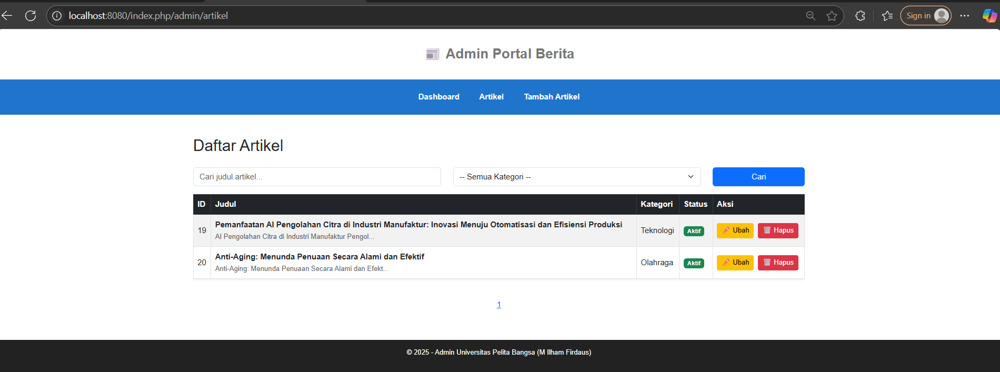

### Tambah Artikel
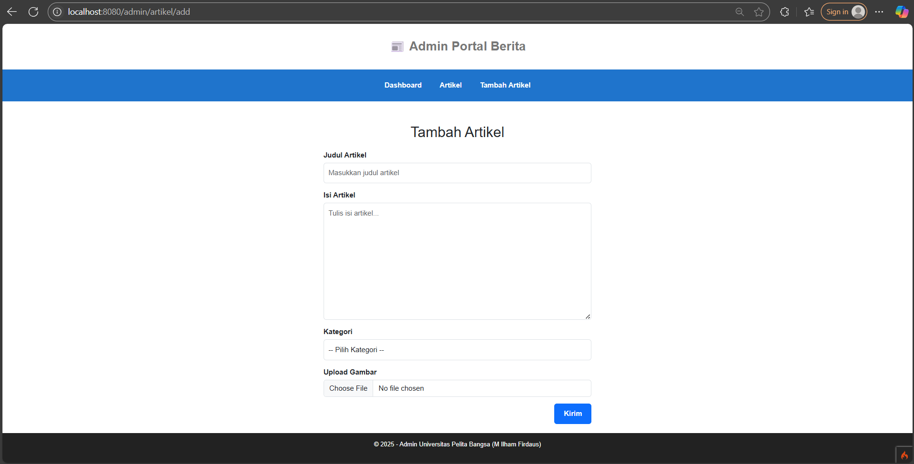

### Edit Artikel
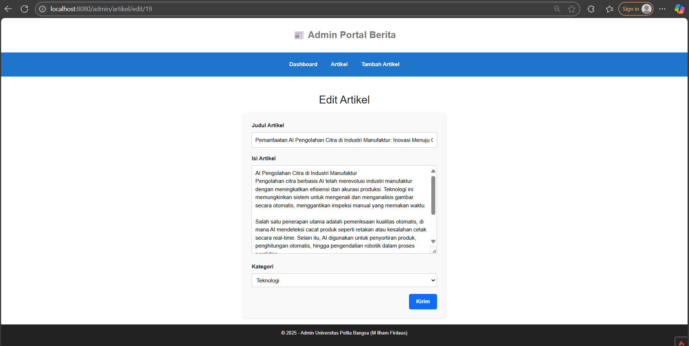

### Tampilan Artikel di Halaman Depan
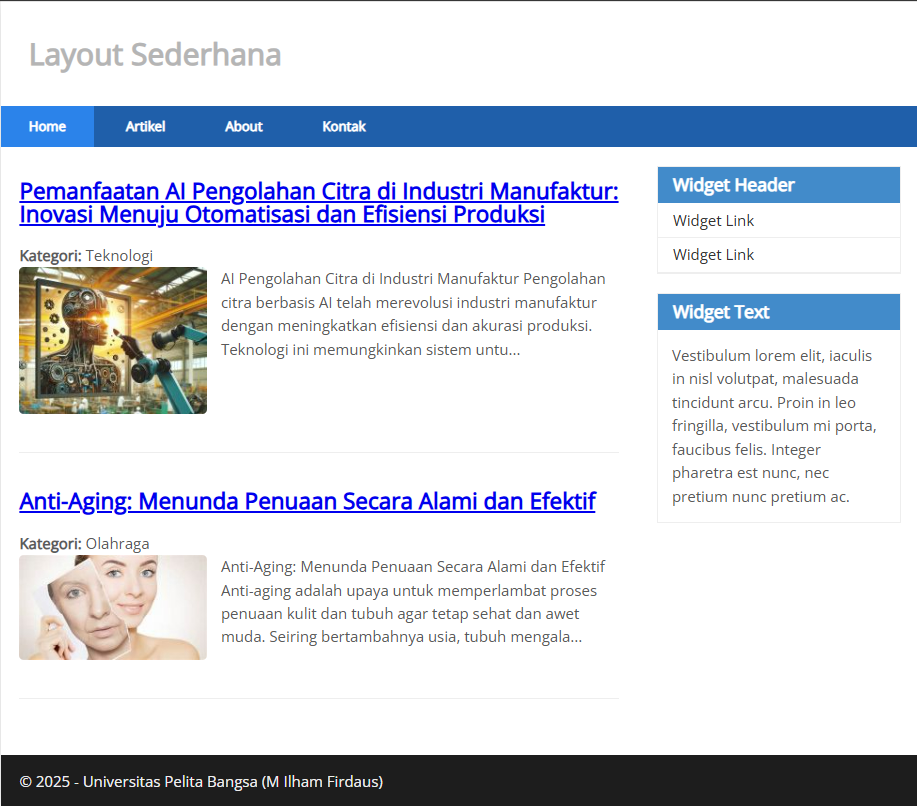

## Langkah Pengerjaan
1. Membuat tabel `kategori`
2. Menambahkan foreign key di tabel `artikel`
3. Membuat `KategoriModel`
4. Modifikasi `ArtikelModel` dan `Artikel Controller`
5. Modifikasi semua view
6. Testing fungsi: tambah, edit, hapus, filter artikel

# Praktikum 8 - AJAX dengan CodeIgniter 4

Modul ini membahas penggunaan AJAX untuk menampilkan dan menghapus data artikel tanpa reload halaman.

## 🚀 Fitur
- Menampilkan daftar artikel menggunakan AJAX
- Menghapus data artikel tanpa reload
- Mengedit data artikel tanpa reload
- Menggunakan jQuery sebagai library
- Menambahkan data artikel tanpa reload

## 📁 Struktur
- Controller: `AjaxController`
- View: `app/Views/ajax/index.php`
- Model: `ArtikelModel`
- jQuery: `public/assets/js/jquery-3.6.0.min.js`

## 📸 Screenshot
### Tabel Data Artikel
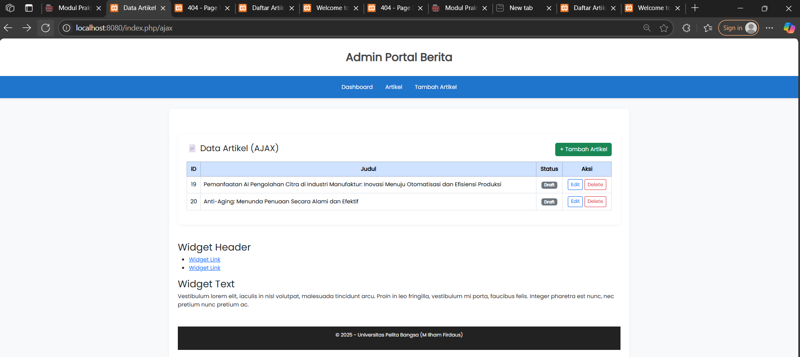

### Tombol Delete AJAX
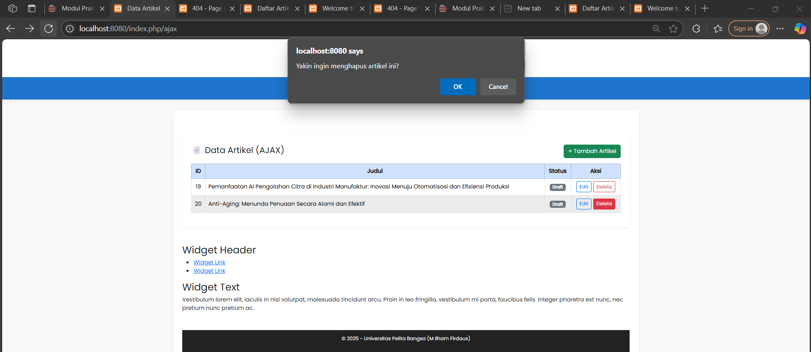

### Tombol Edit AJAX
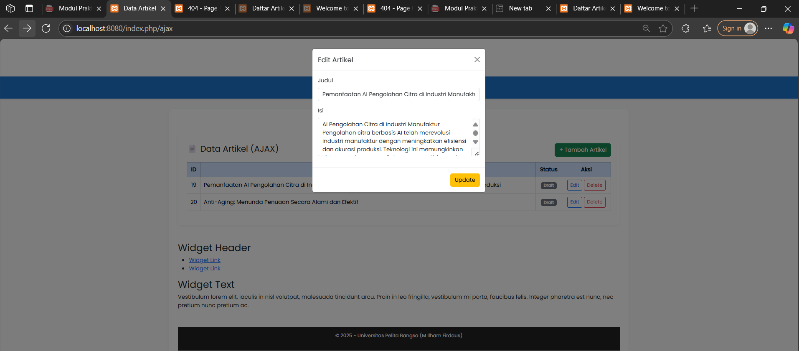

### Tombol +Tambah Artikel AJAX
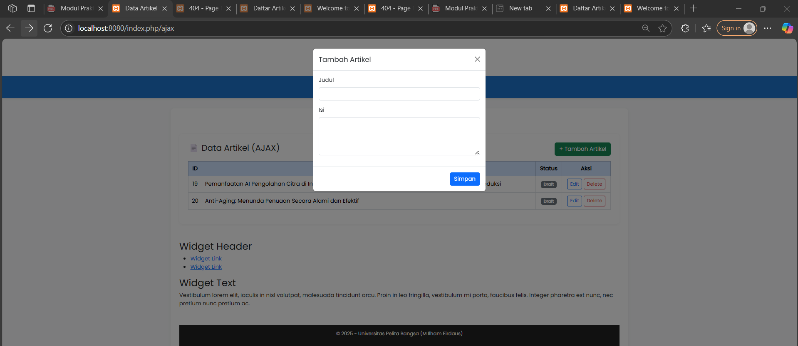

# Modul 9 – AJAX Pagination & Search

## 🎯 Tujuan Praktikum

- Menerapkan pencarian dan pagination dinamis menggunakan AJAX
- Meningkatkan UX aplikasi dengan tampilan real-time dan interaktif
- Menggunakan jQuery untuk permintaan data backend di CodeIgniter 4

---

## 🔧 Teknologi

- CodeIgniter 4
- Bootstrap 5
- jQuery 3.6+

---

## 🛠️ Langkah Pengerjaan

1. Modifikasi `admin_index()` pada controller `Artikel` untuk mendukung AJAX
2. Ubah `admin_index.php`:
   - Tambahkan form pencarian dan filter kategori
   - Tampilkan data artikel dan pagination dengan jQuery
3. Tambahkan indikator loading saat request
4. AJAX otomatis fetch data saat search dan filter berubah

---

## 🧪 Fitur yang Dibuat

| Fitur          | Status |
|----------------|--------|
| AJAX Search    | ✅     |
| AJAX Pagination| ✅     |
| Loading State  | ✅     |
| Kategori Filter| ✅     |

---

## 📸 Tampilan

| 1️⃣ | Tampilan awal halaman admin | Setelah membuka `/admin/artikel` |
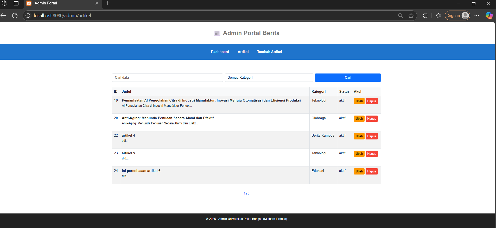
| 2️⃣ | Setelah melakukan pencarian | Isi kolom search, klik "Cari" |
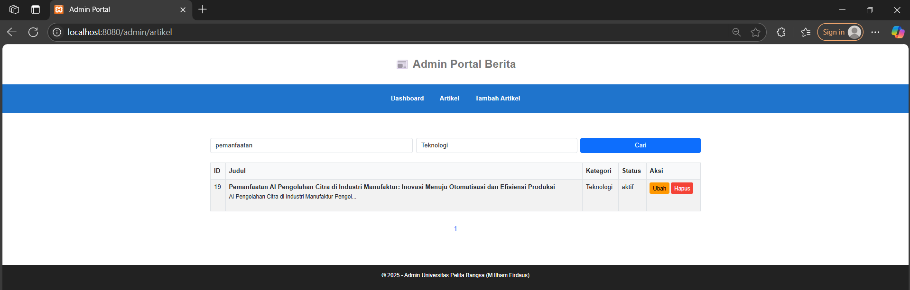
| 3️⃣ | Filter kategori aktif | Pilih kategori tertentu |
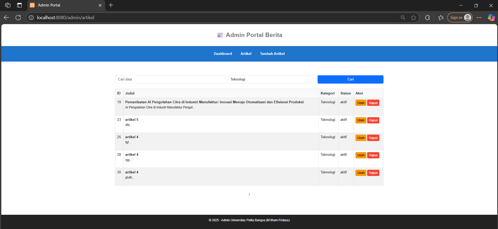
| 4️⃣ | Pagination AJAX berhasil | Klik halaman 2, data berubah tanpa reload |
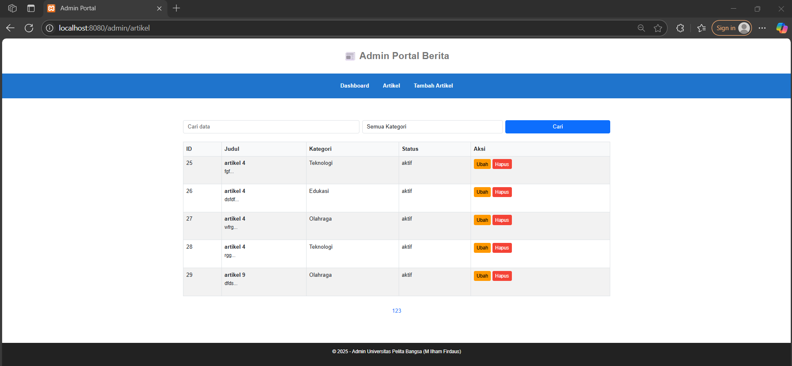
---

# Praktikum 10 - Membuat REST API dengan CodeIgniter 4

Modul ini membahas bagaimana membuat RESTful API menggunakan CodeIgniter 4. Fokus utama adalah mengakses data artikel menggunakan metode HTTP seperti GET, POST, PUT, dan DELETE.

## 🧱 Langkah-langkah Praktikum

## 🔧 1. Persiapan
Buka kembali folder project sebelumnya lab7_php_ci di htdocs (XAMPP).

Jalankan server lokal dan pastikan URL http://localhost:8080 bisa diakses.

📸 Screenshot tampilan awal project
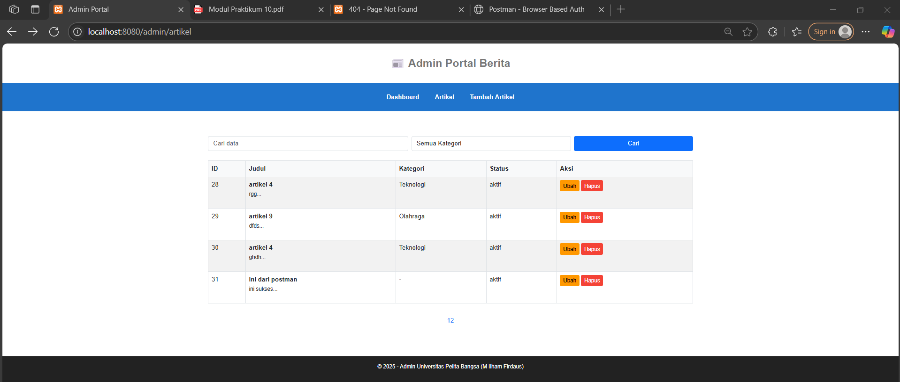

## 📦 2. Install Postman

Unduh Postman dari https://www.postman.com/downloads/

Gunakan untuk menguji endpoint API.

📸 Screenshot aplikasi Postman
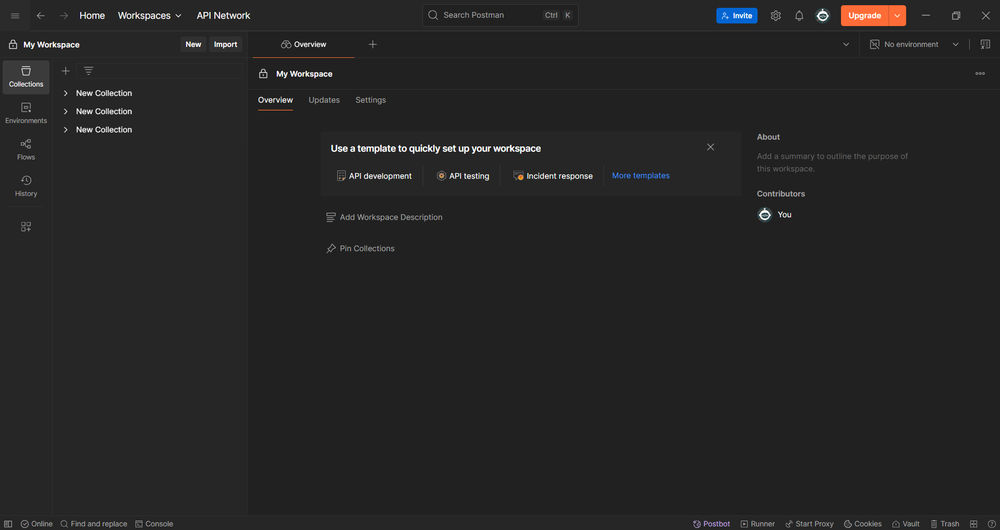

## 🛠 3. Membuat Controller RESTful PostApi.php

Lokasi: app/Controllers/PostApi.php

// lihat kode lengkap di file PostApi.php
📸 Screenshot file controller PostApi.php di VSCode

## 🧭 4. Tambahkan Routing API

Edit file app/Config/Routes.php:
tambahkan 

 $routes->resource('post', ['controller' => 'PostApi']);

📸 Screenshot baris kode routes

## 🧪 5. Uji Endpoint dengan Postman

✅ a. GET – Menampilkan Semua Data
Method: GET

URL: http://localhost:8080/post

📸 Screenshot hasil GET semua data di Postman
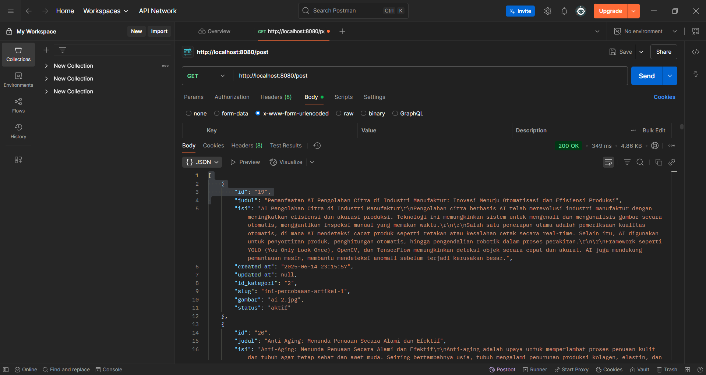

Hasil

✅ b. POST – Menambahkan Data
Method: POST

Body (x-www-form-urlencoded):

judul: Ini dari Postman

isi: ini berhasil

📸 Screenshot hasil POST di Postman

Hasil
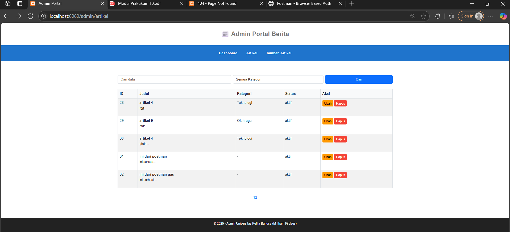

✅ c. PUT – Mengubah Data
Method: PUT

URL: http://localhost:8080/postapi/1

Body (raw, JSON):

json
Salin
Edit
{
  "judul": "Ini dari postman gas",
  "isi": "ini berhasil"
}

atau

Body (x-www-form-urlencoded):

judul: Ini dari postman gas

isi: ini berhasil

Header:

Content-Type: application/json

📸 Screenshot hasil PUT di Postman
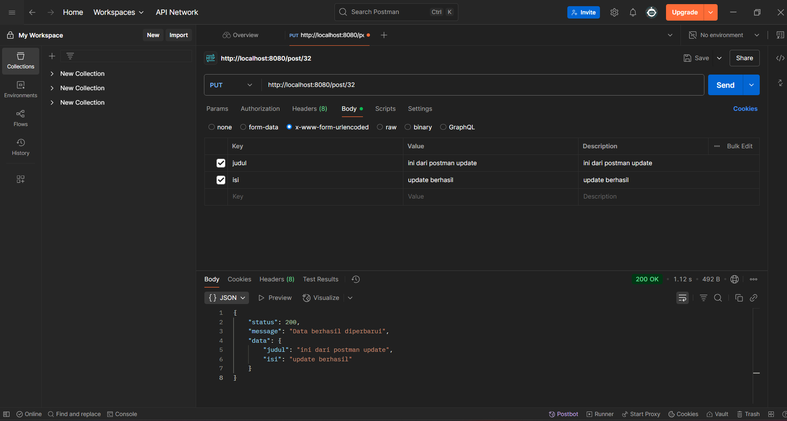

hasil
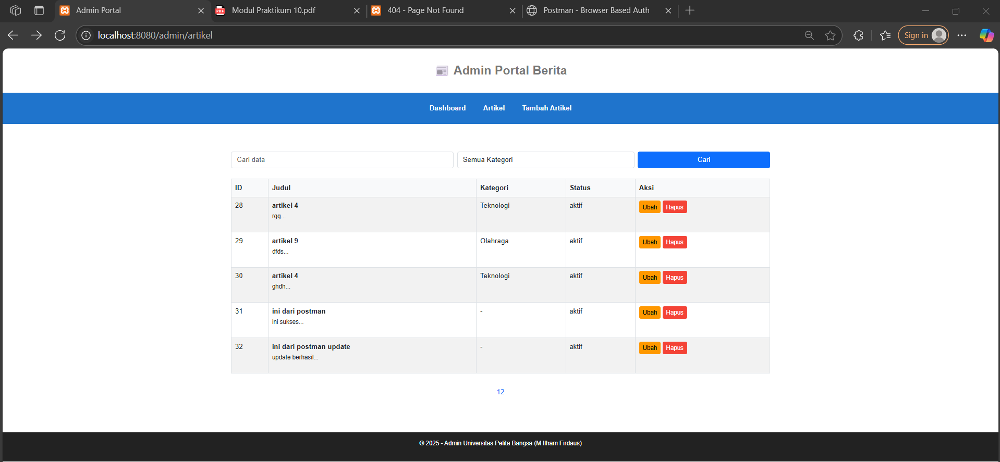

✅ d. DELETE – Menghapus Data
Method: DELETE

URL: http://localhost:8080/postapi/1

📸 Screenshot hasil DELETE di Postman
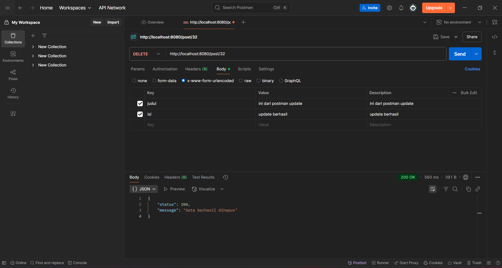

Hasil

## 🧾 Kesimpulan
REST API mempermudah integrasi backend dan frontend.

CodeIgniter 4 menyediakan ResourceController untuk membangun API dengan cepat.

Penggunaan Postman sangat membantu dalam proses pengujian endpoint HTTP.

Format JSON disarankan untuk komunikasi data antar aplikasi.

# 🌐 Web Portal Berita — UI/UX Update ✨

## 🔄 Pembaruan Terbaru

Artikel
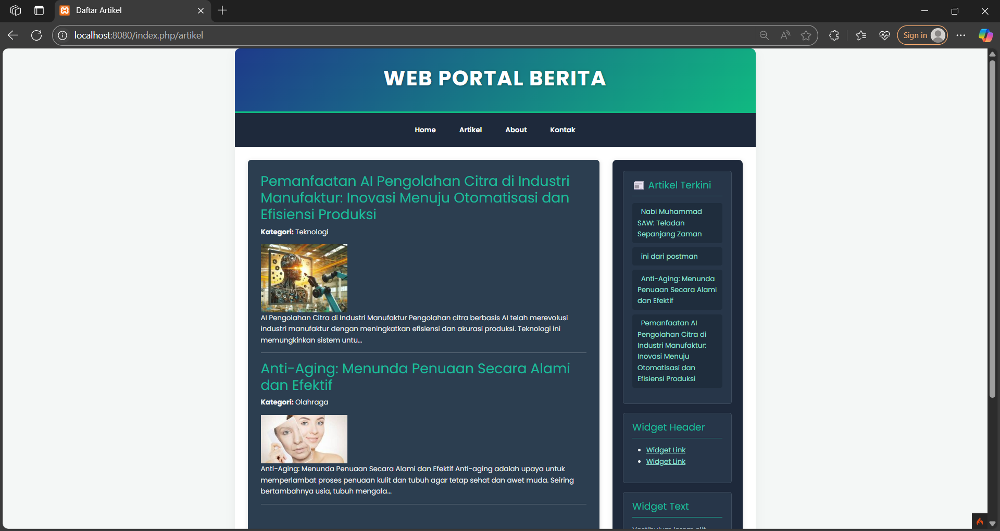

Admin Artikel
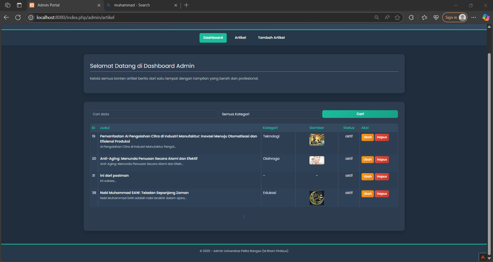

